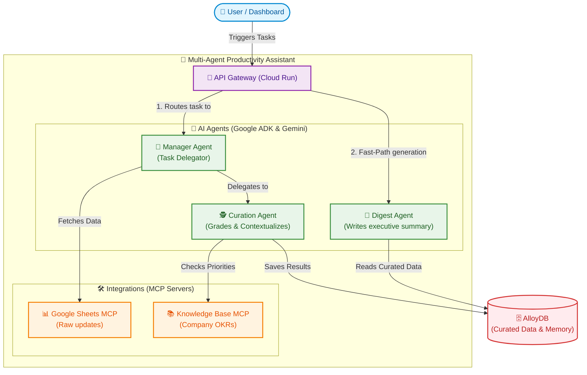
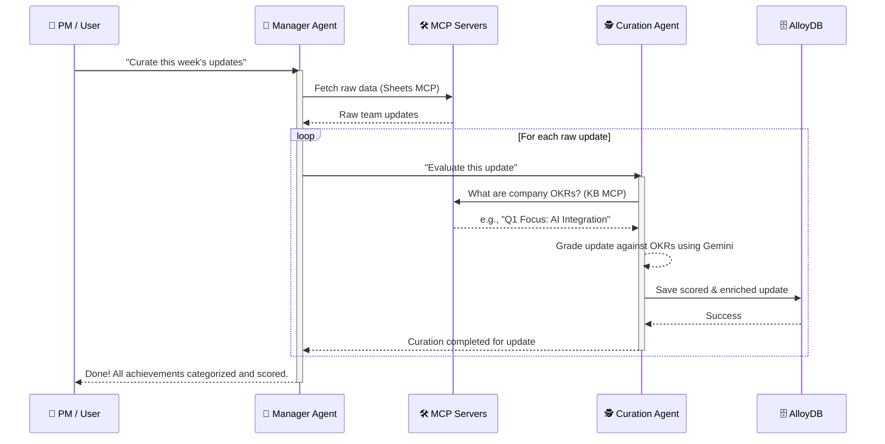
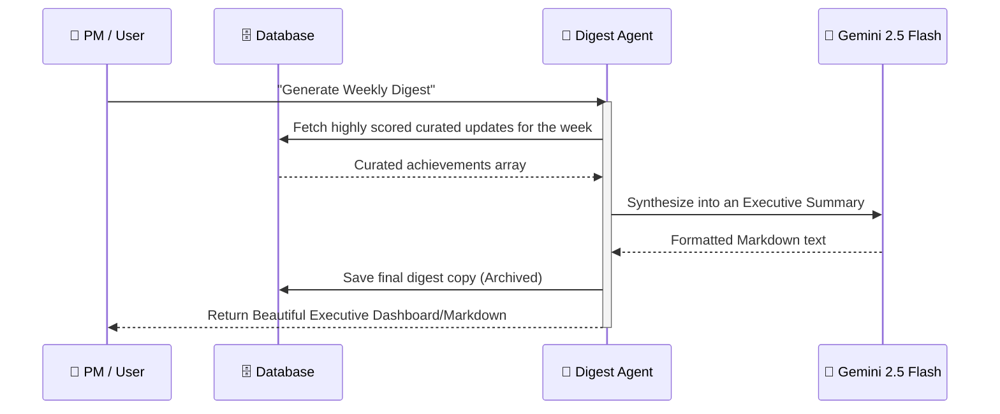

# System Architecture

## Component Diagram
The system follows a microservices-inspired architecture built using the Google Agent Development Kit (ADK) and Model Context Protocol (MCP). The **Manager Agent** acts as the central router for ingestion, accessing MCP tools via standard local child processes and spawning ephemeral `InMemoryRunner` instances to invoke the Curation Agent. To avoid timeouts and optimize database reads, the **Digest Generator Agent** is invoked directly by the API fast-path.

### Component Responsibilities

1. **Client (Browser UI / API Caller)**
   - Acts as the entry point, firing off REST calls (`POST /curate` and `POST /digest/generate`).
   - Receives the final diagnostic event logs or the finalized Markdown digest.

2. **Hono API Routes**
   - Handles the incoming HTTP connections.
   - For curation, it provisions an `InMemoryRunner` linked to the Manager Agent.
   - For digest generation, it provides a fast-path that reads previously generated data from Google AlloyDB via Prisma and directly calls the Digest Generator to output the final results, mitigating cloud execution timeouts.

3. **Manager Agent (Orchestrator)**
   - The "brain" of the operation driven by Google ADK.
   - Reaches out to the Sheets MCP to ingest pending records.
   - Splits tasks into modular operations, calling the Curation Sub-agent via dynamic `FunctionTool` implementations to prevent context bloating within a single prompt and to explicitly track the status per achievement.

4. **MCP Tool Servers**
   - **Sheets MCP**: Exposes endpoints and schemas for reading raw achievement logs (acting as a mock connector to Google Forms/Sheets).
   - **Knowledge Base MCP**: Acts as an internal Vector/KV database emulator. It provides the Curation Agent with qualitative context over company priorities and project scale.

5. **Sub-Agents (Curation & Digest Generator)**
   - **Curation Agent**: Receives raw strings, cross-references with the KB MCP, and writes a strictly typed Zod JSON object quantifying impact straight to AlloyDB. Powered by `gemini-2.5-flash`.
   - **Digest Generator**: Takes the previously persisted JSON items, generates a summarized digest in pure Markdown format, and uses internal DB tools to persist the final output to AlloyDB. Powered by `gemini-2.5-flash`.

6. **External LLM Model (Vertex AI — Gemini)**
   - All agents unify under `gemini-2.5-flash` for high throughput, optimized categorization logic, and prompt responsiveness using Vertex AI Application Default Credentials (ADC).

 

## Curation Flow Sequence Diagram
This diagram outlines the `POST /curate` process. It highlights how the Manager Agent extracts mock data and delegates classification to the Curation Sub-agent, measuring priorities against the Knowledge Base MCP and persisting directly to AlloyDB.

 

## Digest Generation Sequence Diagram
This diagram showcases the `POST /digest/generate` flow. The API directly triggers the Digest Sub-agent using a fast-path, which reads all curated achievements up to this moment and constructs the executive summary.

