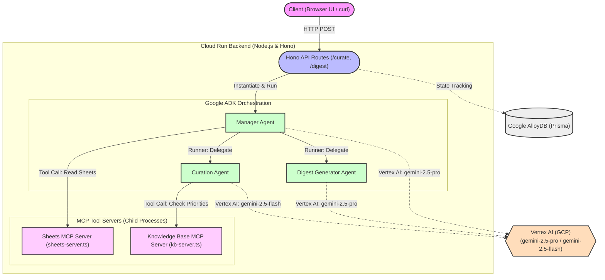
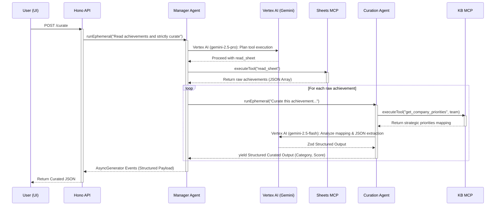
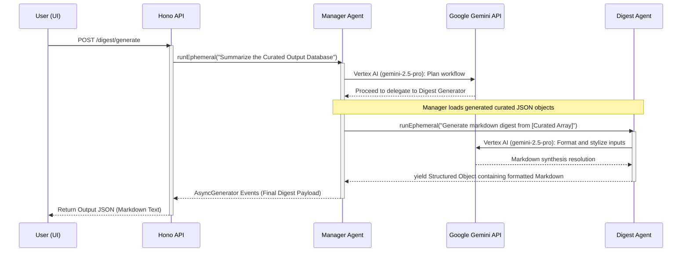

# System Architecture

## Component Diagram
The system follows a microservices-inspired architecture built using the Google Agent Development Kit (ADK) and Model Context Protocol (MCP). The **Manager Agent** acts as the central router, accessing MCP tools via standard local child processes and spawning ephemeral `InMemoryRunner` instances to invoke specific LLM models for curation and synthesis.

### Component Responsibilities

1. **Client (Browser UI / API Caller)**
   - Acts as the entry point, firing off REST calls (`POST /digest/generate`).
   - Receives the final Markdown digest and diagnostic event logs from the server.

2. **Hono API Routes**
   - Handles the incoming HTTP connection and provisions an `InMemoryRunner` linked to the Manager Agent.
   - Iterates through the returning `AsyncGenerator` to safely extract streaming ADK events and the finalized data payloads.
   - Connects to Google AlloyDB via Prisma to read/write persistent platform state (e.g., maintaining digest histories or raw achievement databases if extended).

3. **Manager Agent (Orchestrator)**
   - The "brain" of the operation driven by Google ADK.
   - Assesses the API request and autonomously decides to fetch data via MCP servers.
   - Splits tasks into modular operations, calling sub-agents via dynamic `FunctionTool` implementations to prevent context bloating within a single prompt.

4. **MCP Tool Servers**
   - **Sheets MCP**: Exposes endpoints and schemas for reading raw achievement logs (acting as a mock connector to Google Forms/Sheets).
   - **Knowledge Base MCP**: Acts as an internal Vector/KV database emulator. It provides the Curation Agent with exact "company priorities" criteria natively as requested.

5. **Sub-Agents (Curation & Digest Generator)**
   - **Curation Agent**: Receives raw strings, cross-references with the KB MCP, and returns a strictly typed Zod JSON object quantifying impact. Powered centrally by `gemini-2.5-flash` for high-throughput, low-latency categorization logic.
   - **Digest Generator**: Focuses entirely on presentation and aesthetic language, taking a massive dump of curated JSON items and returning a polished Markdown string ready for distribution. Powered centrally by `gemini-2.5-pro` for advanced systemic reasoning.

6. **External LLM Model (Vertex AI — Gemini)**
   - Responsible for all natural language inference, contextual planning, structured JSON schemas, and content parsing. The Google ADK streams function execution requests transparently to Vertex AI using Application Default Credentials (ADC).

 

## Curation Flow Sequence Diagram
This diagram outlines the `POST /curate` process. It highlights how the Manager Agent extracts mock data and delegates classification to the Curation Sub-agent, measuring priorities against the Knowledge Base MCP while resolving generative responses via the core Gemini models.

 

## Digest Generation Sequence Diagram
This diagram showcases the `POST /digest/generate` flow. The Manager Agent takes previously aggregated or newly minted curated datasets and delegates them to the formatting-focused Digest Sub-agent.

