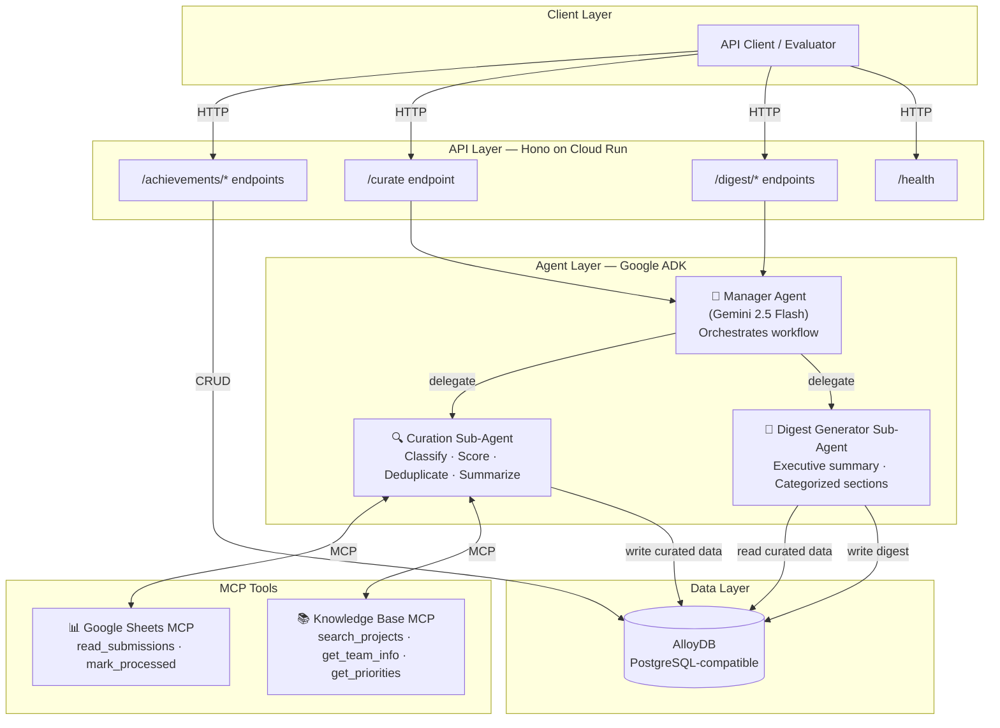

# Minimal Prototype — AI-Powered Weekly Achievement Digest

> [!IMPORTANT]
> **Deadline: April 8th** — This plan is scoped to be buildable in ~1.5 days while hitting every hackathon evaluation criterion.

---

## 1. Prototype Scope

A **multi-agent AI system** that ingests achievement submissions from a Google Sheet, curates them using AI with company knowledge enrichment, and generates a polished weekly digest — deployed as an API on Cloud Run.

```
Google Sheet (submissions) → AI Curation + Enrichment → Weekly Digest
```

---

## 2. Architecture



---

## 3. Agent Design (Google ADK)

All agents use `@google/adk` with Gemini 2.5 Flash.

### Manager Agent (Orchestrator)

| Property | Value |
|---|---|
| **Type** | `LlmAgent` |
| **Role** | Routes user intent to the correct sub-agent |
| **Sub-agents** | Curation Sub-Agent, Digest Generator Sub-Agent |
| **Pattern** | Uses `AgentTool` to delegate dynamically based on the API request |

### Curation Sub-Agent

| Property | Value |
|---|---|
| **Type** | `LlmAgent` |
| **Role** | Processes raw achievements into structured, scored, deduplicated records |
| **MCP Tools** | Google Sheets MCP, Knowledge Base MCP |
| **DB Access** | Writes to `curated_achievements` table |
| **Output** | For each achievement: category, impact_score (0-100), summary, is_duplicate flag |

**Curation workflow:**
1. Calls Sheets MCP → `read_submissions()` → gets raw achievement rows
2. For each achievement, calls Knowledge Base MCP → `search_projects()` / `get_team_info()` → enriches with context
3. Uses Gemini to classify category, score impact, generate concise summary
4. Detects duplicates via semantic similarity
5. Writes curated records to AlloyDB

### Digest Generator Sub-Agent

| Property | Value |
|---|---|
| **Type** | `LlmAgent` |
| **Role** | Generates a formatted weekly digest from curated achievements |
| **DB Access** | Reads from `curated_achievements`, writes to `digests` table |
| **Output** | Markdown digest with executive summary + categorized achievement sections |

---

## 4. MCP Tools — Deep Dive

### 📊 Google Sheets MCP (Achievement Ingestion)

**Why it's meaningful**: This is the **primary data source**. Without it, there are no achievements to curate. It simulates how teams would realistically submit achievements — via a shared Google Sheet.

| Tool | Input | Returns | Used By |
|---|---|---|---|
| `read_submissions` | `{ status?: "pending" }` | Array of raw achievement rows (team, text, date, source) | Curation Sub-Agent |
| `mark_processed` | `{ row_ids: string[] }` | Confirmation | Curation Sub-Agent |
| `get_sheet_stats` | — | Total rows, pending count, processed count | Manager Agent |

**Implementation**: Mock MCP server using `@modelcontextprotocol/sdk` with in-memory data representing ~20 realistic achievement submissions from different teams. Pre-seeded with diverse scenarios (project completions, customer wins, innovations, process improvements).

```typescript
// Served via Stdio transport, connected to ADK via MCPToolset
const server = new McpServer({ name: "sheets-mcp", version: "1.0.0" });

server.tool("read_submissions", { status: z.enum(["pending","processed","all"]).optional() },
  async ({ status }) => {
    // Returns filtered rows from mock sheet data
    return mockSheetData.filter(row => !status || row.status === status);
  }
);
```

---

### 📚 Company Knowledge Base MCP (Achievement Enrichment)

**Why it's meaningful**: Makes the AI **demonstrably smarter**. Without it, the agent scores achievements generically. With it, the agent understands business context and produces richer summaries. The before/after difference is the demo's "wow moment."

| Tool | Input | Returns | Used By |
|---|---|---|---|
| `search_projects` | `{ query: string }` | Project details: description, priority, budget tier, department, stakeholders | Curation Sub-Agent |
| `get_team_info` | `{ team_name: string }` | Team size, department, manager, focus areas, recent wins | Curation Sub-Agent |
| `get_company_priorities` | `{ quarter: string }` | List of strategic priorities for the quarter | Curation Sub-Agent |

**Implementation**: Mock MCP server with pre-loaded data for ~10 projects, ~6 teams, and quarterly priorities that match the seed achievement data.

```typescript
server.tool("search_projects", { query: z.string() },
  async ({ query }) => {
    // Fuzzy match against mock project database
    // Returns: { name, description, priority, budget_tier, department, stakeholders }
    return findMatchingProjects(query);
  }
);
```

**Demo impact** — Side-by-side comparison:

| | Without Knowledge Base | With Knowledge Base |
|---|---|---|
| **Score** | 55/100 (generic) | 92/100 (knows it's a P0 strategic initiative) |
| **Summary** | "Team Alpha completed a migration project." | "Team Alpha completed Project Phoenix, a strategic $2M cloud migration impacting 3 business units, directly supporting Q1's infrastructure modernization priority." |

---

## 5. Database Schema (AlloyDB via Prisma)

```prisma
datasource db {
  provider = "postgresql"
  url      = env("DATABASE_URL")   // AlloyDB connection string
}

model Achievement {
  id          String   @id @default(uuid())
  text        String   // raw submission text
  team        String
  source      String   // e.g., "google_sheets", "api"
  submittedAt DateTime @default(now()) @map("submitted_at")
  curated     CuratedAchievement?
  @@map("achievements")
}

model CuratedAchievement {
  id            String   @id @default(uuid())
  achievementId String   @unique @map("achievement_id")
  achievement   Achievement @relation(fields: [achievementId], references: [id])
  category      String   // Innovation | Customer Success | Team Milestone | Process Improvement | Individual Recognition
  impactScore   Int      @map("impact_score")  // 0-100
  summary       String   // AI-generated concise summary
  isDuplicate   Boolean  @default(false) @map("is_duplicate")
  enrichment    Json?    // project/team context from Knowledge Base MCP
  curatedAt     DateTime @default(now()) @map("curated_at")
  @@map("curated_achievements")
}

model Digest {
  id          String   @id @default(uuid())
  weekStart   DateTime @map("week_start")
  weekEnd     DateTime @map("week_end")
  contentMd   String   @map("content_md")   // Generated markdown digest
  stats       Json?    // { total_achievements, categories_breakdown, avg_impact_score }
  generatedAt DateTime @default(now()) @map("generated_at")
  @@map("digests")
}
```

---

## 6. API Endpoints (Hono)

| Method | Endpoint | Description | Agent Involved |
|---|---|---|---|
| `POST` | `/achievements/submit` | Submit a single achievement via API | — (direct DB write) |
| `POST` | `/achievements/submit-batch` | Submit multiple achievements (demo seeding) | — (direct DB write) |
| `GET` | `/achievements` | List all achievements with curation status | — (direct DB read) |
| `POST` | `/curate` | **Trigger AI curation pipeline** | Manager → Curation Sub-Agent |
| `POST` | `/digest/generate` | **Generate the weekly digest** | Manager → Digest Generator Sub-Agent |
| `GET` | `/digest/latest` | Retrieve the most recent digest | — (direct DB read) |
| `GET` | `/health` | Health check for Cloud Run | — |

---

## 7. Tech Stack

| Layer | Technology | npm Package |
|---|---|---|
| **AI Agents** | Google ADK | `@google/adk` |
| **AI Model** | Gemini 2.5 Flash | via ADK config |
| **Dev Tools** | ADK Dev UI | `@google/adk-devtools` |
| **API Server** | Hono | `hono`, `@hono/node-server` |
| **ORM** | Prisma | `prisma`, `@prisma/client` |
| **Database** | AlloyDB (PostgreSQL) | — (cloud service) |
| **MCP SDK** | Model Context Protocol | `@modelcontextprotocol/sdk` |
| **Validation** | Zod | `zod` |
| **Language** | TypeScript | `typescript` |
| **Runtime** | Node.js 20 LTS | — |
| **Deployment** | Google Cloud Run | Docker container |

---

## 8. Hackathon Checklist

| Requirement | Status | Implementation |
|---|---|---|
| Manager agent + sub-agents | ✅ | Manager Agent → Curation + Digest Generator sub-agents via ADK |
| Reliable database | ✅ | **AlloyDB** with Prisma ORM (PostgreSQL-compatible, mentioned in eval criteria) |
| MCP tool integration | ✅ | Google Sheets MCP (ingestion) + Knowledge Base MCP (enrichment) |
| Multi-step workflow | ✅ | Ingest → Enrich → Classify → Score → Deduplicate → Generate Digest |
| API deployment on Cloud Run | ✅ | Hono app containerized and deployed |
| Google Cloud technologies | ✅ | Gemini + Cloud Run + AlloyDB (covers 20% eval weight) |
| Presentation | ✅ | Official template |
| GitHub public repo | ✅ | — |
| Demo video | ✅ | End-to-end walkthrough |

---

## 9. What's IN vs OUT

### ✅ In Scope
1. Achievement submission via API + Google Sheets MCP ingestion
2. AI curation pipeline with knowledge-base enrichment
3. Weekly digest generation with executive summary
4. Multi-agent orchestration via Google ADK
5. 2 meaningful MCP tool integrations
6. AlloyDB cloud database with Prisma
7. Cloud Run deployment
8. Seed data (~20 diverse achievements)

### ❌ Out of Scope (Future Enhancements)
- Real email ingestion / unattended mailbox
- Personalization per employee role
- Engagement features (voting, commenting, sharing)
- Approval/review workflows
- Analytics dashboards
- Frontend UI
- Multi-channel distribution
- Time-zone-aware scheduling

---

## 10. Project Structure

```
achievement-digest/
├── src/
│   ├── index.ts                 # Hono app entry point
│   ├── routes/
│   │   ├── achievements.ts      # /achievements/* routes
│   │   ├── curate.ts            # /curate route
│   │   └── digest.ts            # /digest/* routes
│   ├── agents/
│   │   ├── manager.ts           # Manager Agent definition
│   │   ├── curation.ts          # Curation Sub-Agent
│   │   └── digestGenerator.ts   # Digest Generator Sub-Agent
│   ├── mcp/
│   │   ├── sheets-server.ts     # Google Sheets MCP server
│   │   ├── sheets-data.ts       # Mock sheet data (seed)
│   │   ├── kb-server.ts         # Knowledge Base MCP server
│   │   └── kb-data.ts           # Mock knowledge base data
│   └── db/
│       └── client.ts            # Prisma client singleton
├── prisma/
│   ├── schema.prisma            # Database schema
│   └── seed.ts                  # Seed script
├── Dockerfile
├── .env.example
├── package.json
├── tsconfig.json
└── README.md
```

---

## 11. Step-by-Step Execution Plan

### Phase 1: Project Setup (Day 1 — 2 hours)

| Step | Task | Details |
|---|---|---|
| 1.1 | Initialize project | `npm init -y`, install `typescript`, `hono`, `@hono/node-server`, `zod` |
| 1.2 | Configure TypeScript | `tsconfig.json` with `ESNext` module, `NodeNext` module resolution |
| 1.3 | Set up Prisma | `npm install prisma @prisma/client`, `npx prisma init` |
| 1.4 | Provision AlloyDB | GCP Console → AlloyDB → Create cluster + primary instance (~15 min) |
| 1.5 | Connect Prisma to AlloyDB | Set `DATABASE_URL` in `.env`, define schema, run `npx prisma db push` |
| 1.6 | Build basic Hono server | Health check endpoint, Prisma client singleton, verify DB connection |

**Checkpoint**: `GET /health` returns `200 OK` with DB connection status.

---

### Phase 2: Achievement CRUD (Day 1 — 1.5 hours)

| Step | Task | Details |
|---|---|---|
| 2.1 | Build achievement routes | `POST /achievements/submit`, `POST /achievements/submit-batch`, `GET /achievements` |
| 2.2 | Create seed data | Write `prisma/seed.ts` with 20 diverse mock achievements |
| 2.3 | Seed the database | Run `npx prisma db seed` to populate AlloyDB |

**Checkpoint**: Submit and list achievements via API.

---

### Phase 3: MCP Servers (Day 1 — 2 hours)

| Step | Task | Details |
|---|---|---|
| 3.1 | Install MCP SDK | `npm install @modelcontextprotocol/sdk` |
| 3.2 | Build Sheets MCP server | `src/mcp/sheets-server.ts` — `read_submissions`, `mark_processed`, `get_sheet_stats` tools. Pre-load with 20 mock rows matching seed data scenarios. |
| 3.3 | Build Knowledge Base MCP server | `src/mcp/kb-server.ts` — `search_projects`, `get_team_info`, `get_company_priorities` tools. Pre-load with 10 projects, 6 teams, Q1 priorities. |
| 3.4 | Test MCP servers standalone | Verify tools respond correctly via direct calls |

**Checkpoint**: Both MCP servers start and respond to tool calls.

---

### Phase 4: AI Agents (Day 1 — 3 hours)

| Step | Task | Details |
|---|---|---|
| 4.1 | Install ADK | `npm install @google/adk`, `npm install -D @google/adk-devtools` |
| 4.2 | Build Curation Sub-Agent | Connect Sheets MCP + KB MCP via `MCPToolset`. Instruction prompt for classify, score, summarize, deduplicate. Write results to AlloyDB. |
| 4.3 | Build Digest Generator Sub-Agent | Reads curated achievements from DB. Generates markdown digest with executive summary + categorized sections. Writes to `digests` table. |
| 4.4 | Build Manager Agent | Wraps both sub-agents. Routes `/curate` → Curation, `/digest/generate` → Digest Generator. |
| 4.5 | Wire agents to Hono routes | `POST /curate` triggers Manager → Curation pipeline. `POST /digest/generate` triggers Manager → Digest generation. |
| 4.6 | Test with ADK Dev UI | Use `@google/adk-devtools` to debug agent interactions, inspect session state, verify MCP tool calls. |

**Checkpoint**: Full pipeline works locally — curate achievements, generate digest.

---

### Phase 5: Containerize & Deploy (Day 2 — 2 hours)

| Step | Task | Details |
|---|---|---|
| 5.1 | Write Dockerfile | Multi-stage build: install deps → build TypeScript → slim production image |
| 5.2 | Create `.dockerignore` | Exclude `node_modules`, `.git`, `.env` |
| 5.3 | Test Docker locally | `docker build && docker run` — verify all endpoints work |
| 5.4 | Push to Artifact Registry | `gcloud builds submit --tag gcr.io/[PROJECT]/achievement-digest` |
| 5.5 | Deploy to Cloud Run | `gcloud run deploy` with env vars for `DATABASE_URL`, `GOOGLE_API_KEY` |
| 5.6 | Verify Cloud Run | Hit all endpoints on the live URL |

**Checkpoint**: Live Cloud Run URL works end-to-end.

---

### Phase 6: Demo & Submission (Day 2 — 2 hours)

| Step | Task | Details |
|---|---|---|
| 6.1 | Push to GitHub | Create public repo, clean up code, write README |
| 6.2 | Record demo video | Follow the demo flow below |
| 6.3 | Prepare presentation | Use official hackathon template |
| 6.4 | Submit | Cloud Run link + GitHub link + demo video + presentation |

---

## 12. Demo Flow (5 Minutes)

| # | Duration | Action | What Evaluator Sees |
|---|---|---|---|
| 1 | 30s | **Problem Context** | Slide explaining scattered achievements, no visibility |
| 2 | 30s | Show Sheets MCP data | "Here are 20 raw achievement submissions from various teams" |
| 3 | 45s | `POST /curate` | Agent reads from Sheets MCP, queries Knowledge Base MCP for enrichment, classifies and scores each achievement |
| 4 | 45s | Show curation results | `GET /achievements` — each achievement now has category, score, enriched summary. Highlight before/after quality difference. |
| 5 | 60s | `POST /digest/generate` | Agent generates polished weekly digest with executive summary and categorized sections |
| 6 | 30s | `GET /digest/latest` | Display the beautiful generated digest |
| 7 | 30s | Architecture walkthrough | Show the multi-agent + MCP + AlloyDB diagram |
| 8 | 30s | Live Cloud Run | Same flow running on deployed URL |

> [!TIP]
> **Wow moment**: Show the same achievement curated *without* the Knowledge Base MCP (generic score: 55) vs *with* it (enriched score: 92, context-rich summary). This single comparison proves why MCP matters.

---

## 13. Risk Mitigation

| Risk | Mitigation |
|---|---|
| AlloyDB provisioning takes too long | **Fallback**: Cloud SQL for PostgreSQL (5 min setup). Prisma works identically — just swap the `DATABASE_URL`. |
| ADK TypeScript API differences from docs | Use `@google/adk-devtools` for real-time debugging. ADK Dev UI shows agent decisions and tool calls. |
| MCP connection issues between agent and servers | Use **Stdio transport** (in-process) instead of HTTP/SSE — eliminates network issues during development. |
| Gemini rate limits during demo | Pre-curate achievements before demo. Cache digest output. Demo `GET /digest/latest` as fallback. |
| Time pressure | Phases 1–4 are the core. Phase 5 (deploy) uses `gcloud run deploy --source .` for zero-Dockerfile fallback. |
